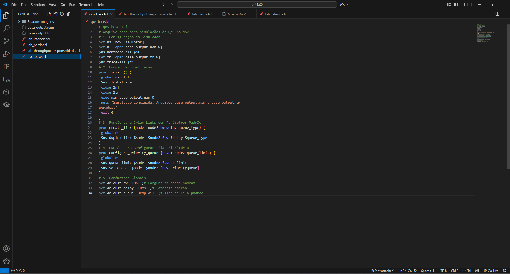
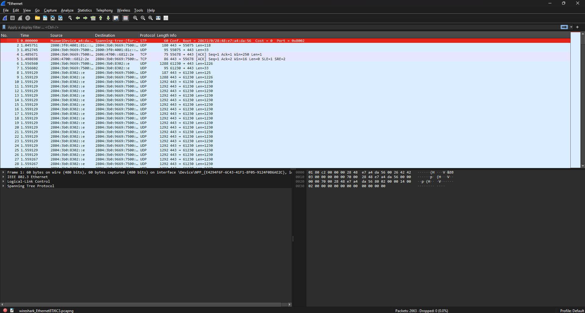
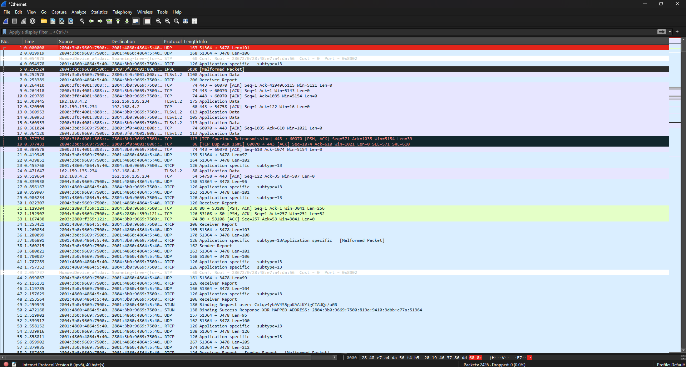
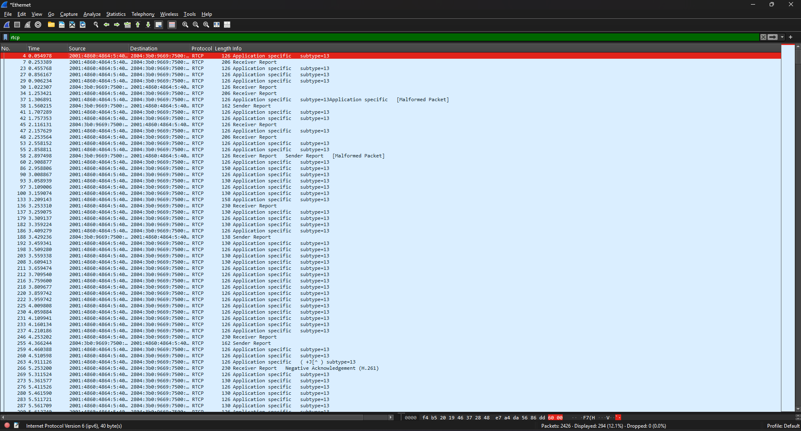
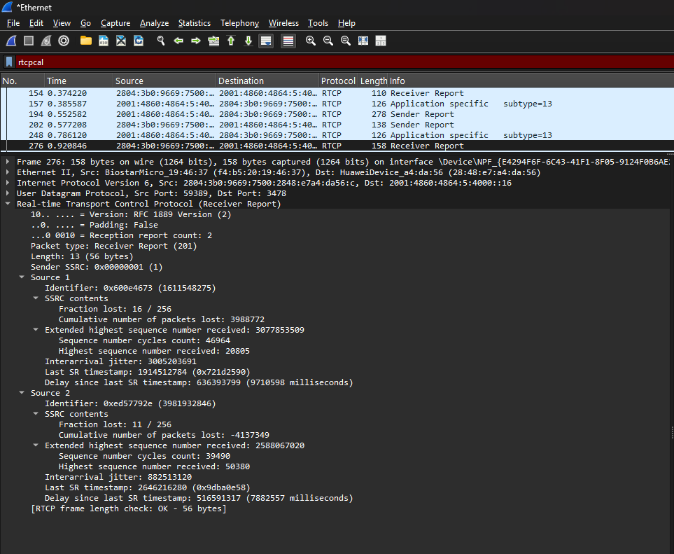

# Relatório de Laboratório: Qualidade de Serviço (QoS) - A Otimização da Jornada dos Pacotes

**Disciplina:** Redes de Computadores II
**Professora:** Angelita Rettore de Araujo

**Nome do Aluno:** Gabriel Nogueira

**Turma:** 6° Fase

---

## 1. Introdução

Este laboratório aborda a **Qualidade de Serviço (QoS)**, um conjunto de mecanismos importantes para gerenciar o tráfego de rede e assegurar que aplicações críticas recebam tratamento preferencial. Diferente dos laboratórios anteriores que focaram na confiabilidade (garantir que os pacotes cheguem), o objetivo aqui é garantir que os pacotes cheguem *com qualidade* – ou seja, com a latência, jitter, throughput e perda de pacotes adequados.

A importância da QoS é contextualizada pela **narrativa da telecirurgia**, onde cada pacote de comando tátil, voz ou dado vital do paciente é crucial. Atrasos, variações irregulares na chegada ou perda de pacotes podem ter consequências catastróficas.

## 2. Objetivos

Os principais objetivos deste laboratório são:
1.  **Compreender e medir** os conceitos fundamentais de Latência, Jitter, Throughput, Perda de Pacotes e Classificação de Tráfego no contexto de QoS.
2.  **Configurar e executar simulações** no **Network Simulator 2 (NS2)** para observar o comportamento da rede sob diferentes condições de QoS.
3.  **Utilizar o Wireshark** para capturar e analisar o tráfego de rede, medindo parâmetros de QoS em tempo real.
4.  **Analisar o impacto** da variação dos parâmetros de QoS no desempenho de diferentes tipos de aplicações.
5.  **Comparar a tolerância a perdas e a sensibilidade à latência e jitter** de diversas aplicações.
6.  **Propor soluções** baseadas em QoS para otimizar o desempenho de aplicações críticas em cenários de rede desafiadores.

## 3. Ferramentas Utilizadas

*   **Network Simulator 2 (NS2)**: Ambiente de simulação de rede para modelar cenários.
*   **Wireshark**: Analisador de protocolo de rede para captura e inspeção de pacotes em tempo real.
*   **Acesso à Internet**: Para testes com ferramentas online (como Google Meet).

---

## 4. Parte I: Relembrando a Jornada – Preparando o Ambiente

**Contexto Teórico:** A narrativa da cirurgia remota é a base para entender a importância dos "pacotes heróis" (Pablo, Melody, Flash e Data) e como a QoS é vital para a missão deles de salvar uma vida.

### **4.1. Verificação e Configuração Inicial do NS2**

*   Confirmei a instalação do NS2 e criei o arquivo `qos_base.tcl`.

**Entrega:** Captura de tela do `qos_base.tcl` no editor de texto.




### **4.2. Configuração Inicial do Wireshark**

*   Abri o Wireshark e selecionei a interface de rede correta para captura.

**Entrega:** Captura de tela do Wireshark com a interface de captura selecionada.




---

## 5. Parte II: Latência (Delay) – O Tempo é Essencial

**Contexto Teórico:** A latência é o tempo que um pacote leva para ir da origem ao destino, como o tempo para o comando tátil do Dr. Martinez (Flash) chegar ao bisturi em Manaus.

### **5.1. Simulação de Latência no NS2**

*   Criei e executei o script `lab_latencia.tcl`, experimentando diferentes valores para `link_delay` (ex: 10ms, 100ms, 200ms).

**Entrega:** O código `lab_latencia.tcl` utilizado.

```tcl
# # lab_latencia.tcl
# Simulação de Latência (Delay)

# 1. Importação do Arquivo Base
source qos_base.tcl

# 2. Criação dos Nós
set n0 [$ns node] 
set n1 [$ns node]

# 3. Criação do Link com Latência Variável
# Experimente diferentes valores para o delay (ex: 10ms, 100ms, 500ms)
set link_delay "10ms" ;# Latência do link 
create_link $n0 $n1 $default_bw $link_delay $default_queue 

# 4. Criação dos Agentes e Aplicações
set udp0 [new Agent/UDP] 
$ns attach-agent $n0 $udp0 
set cbr0 [new Application/Traffic/CBR] 
$cbr0 attach-agent $udp0 
$cbr0 set packetSize_ 1000 
$cbr0 set interval_ 0.01 ;# 100 pacotes/segundo 
set null0 [new Agent/Null] 
$ns attach-agent $n1 $null0 
$udp0 set class_ 0 ;# Para identificação no trace 
$ns connect $udp0 $null0 

# 5. Agendamento de Eventos 
$ns at 0.5 "$cbr0 start" 
$ns at 4.5 "$cbr0 stop" 
$ns at 5.0 "finish" 

# 6. Início da Simulação 
$ns run   
```

### **5.2. Análise da Latência no Arquivo de Trace (.tr)**

*   Analisei o arquivo `lab_latencia.tr`, identificando o envio e recebimento de pacotes para calcular a latência de ponta a ponta.

**Entrega:** Trecho do arquivo `.tr` destacando um pacote enviado e seu respectivo recebimento.
```
# + 0.5 0 1 cbr 1000 ------- 0 0.0 1.0 0 0
- 0.5 0 1 cbr 1000 ------- 0 0.0 1.0 0 0
r 0.518 0 1 cbr 1000 ------- 0 0.0 1.0 0 0

```

**Cálculos da Latência:**

| `link_delay` Configurado | Timestamp Envio | Timestamp Recebimento | Latência Calculada |
| :----------------------- | :-------------- | :-------------------- | :----------------- |
| [Valor 1 (e.g., 10ms)]   |   [0.5]         |       [0.518]         |      [18ms]        |
| [Valor 2 (e.g., 100ms)]  |   [0.5]         |       [0.608]         |      [108ms]       |
| [Valor 3 (e.g., 200ms)]  |   [0.5]         |       [0.708]         |      [208ms]       |

### **5.3. Perguntas para Refletir e Discutir**

1.  **Qual a relação entre o `link_delay` configurado no script e a latência medida no arquivo `.tr`?**

    Com a análise do .tr, podemos verificar que o link_delay tem uma relação clara.

    O link_delay, traduzido para uma expressão que facilita seu entendimento, seria "propagação". Ele vai nos dar a             informação do tempo entre os links, no nosso caso, a propagação no link entre os nós 1 e 2. O .tr nos dá várias           informações, não     apenas a de propagação; ele nos dá o escopo completo do delay, ajudando a identificar a demora em         alguns processos, como o de processamento ou o de envio do pacote. O de propagação, por sua vez, confirma a ligação         direta entre eles.
  
3.  **Como a latência afeta a percepção do usuário em aplicações como VoIP ou jogos online?**

    Foi introduzido aos alunos de redes dois conceitos, as aplicações elásticas e as em tempo real. As elásticas não são o     foco dessa resposta mas, resumidamente, são menos afetadas. As que entram em estado crítico com delay são as em tempo     real, elas sofrem pois os dados precisam chegar de forma segura, padronizada e sem atraso, caso nossa rede tenha algum     problema de atraso nas aplicações em tempo real vamos ter alguns problemas típicos. Em VoIP, quando sua tia do Acre         tentar se comunicar com um “Oi”, você poderá ouvir uma voz travada. Quando o assunto é jogos online, um simples clique     no botão pode demorar mais do que o esperado, assim, frustrando sua jogatina.
      
4.  **Se o Dr. Martinez estivesse em Tóquio e o paciente em Manaus, qual seria o impacto na latência?**

    Se a latência começasse a ser um empecilho levando em consideração o caso da telecirurgia, muitos fatores seriam           afetados. Começando com a visualização da cirurgia em vídeo HD, a maior probabilidade seria de atraso na imagem, isso     isolado parece não afetar tanto mas, entramos nos outros fatores. Com um atraso na imagem, o doutor sofre de movimentos     irregulares no sinal da sua mão, podendo ser fatal, junto de um áudio com delay, assim informações seriam imprecisas       no momento certo. Por último os batimentos do paciente, é a peça com menor prioridade de gravidade mas resulta em         perda de informações críticas.

Sabendo dessas variáveis, podemos ter certeza que uma cirurgia pode ser realizada apenas com a certeza de uma ótima estabilização na rota da rede.

---

## 6. Parte III: Jitter e Perda de Pacotes – A Variação Inesperada e o Preço da Imperfeição

**Contexto Teórico:** **Jitter** é a variação no atraso dos pacotes, causando "voz robotizada" (pacotes de Melody). A **perda de pacotes** ocorre quando um pacote não chega, sendo a tolerância variável por aplicação (pacotes de Data). O **RTCP (Real-Time Control Protocol)** é utilizado por aplicações em tempo real (como Google Meet) para reportar a qualidade da transmissão, incluindo jitter e perda.

### **6.1. Análise do Jitter e Perda de Pacotes no Wireshark (Captura Local de RTCP)**

*   Iniciei uma chamada no Google Meet e capturei o tráfego com o Wireshark.
*   Filtrei o tráfego por `rtcp` e identifiquei os tipos de pacotes (SR, RR, SDES, Bye).
*   Analisei os **Receiver Reports (RR)** para localizar os campos `Fraction Lost`, `Cumulative Number of Packets Lost` e `Interarrival Jitter`.

**Entregas:**

1.  Captura de tela do Wireshark mostrando a captura inicial de pacotes.
   
    
   
2.  Captura de tela do Wireshark mostrando o filtro `rtcp` aplicado.
  
    
    
3.  Captura de tela dos detalhes de um pacote **Receiver Report (RR)**, com os campos `Fraction Lost`, `Cumulative Number of Packets Lost` e `Interarrival Jitter` claramente visíveis.
  
    


**Valores Observados:**

*   **Interarrival Jitter:**  3.005.203.691 obs: não consegui pegar a lógica para transformas em ms.
*   **Fraction Lost:**  16 / 256 (equivalente a 6,25%)
*   **Cumulative Number of Packets Lost:** 3.988.772

### **6.2. Perguntas para Refletir e Discutir**

1.  **Como esses valores de Jitter e Fraction Lost se comparam aos limites aceitáveis para uma boa qualidade de voz/vídeo (ex: jitter idealmente abaixo de 30ms, perda abaixo de 1%)?**

    Os valores observados na captura da minha Ethernet acabaram se mostrando negativos, um resultado de 6% de perda é algo     inicialmente preocupante. Bom, não convertemos o Jitter mas podemos ter uma boa ideia do limite de 30 ms permitido por     ele, o número pode representar um valor mais alto assim não sendo o cenário ideal.
       
2.  **Por que o RTCP é essencial para aplicações em tempo real, mesmo que o RTP (dados de mídia) esteja criptografado?**

    O RTP tem sua função de criptografia, ela faz a segurança dos pacotes onde é descompactada apenas no receptor, nesse       caso, no ouvinte de chamada. Sabendo disso se define que esses envios criptografados sem o RTCP acabariam não tendo       nenhuma verificação, agora o que o RTCP faz, ele nos traz os dados que coletamos para a análise para sabermos como está     a saúde das aplicações.

3.  **Como as informações de jitter e perda de pacotes reportadas pelo RTCP podem ser usadas pela aplicação (Google Meet) para ajustar a qualidade da transmissão?**

    Com o fornecimento dos dados vindo do RTCP, o Google Meet consegue contornar situações desagradáveis com facilidade, o     mundo é gigantesco para mitigar os erros e alguns deles são: Reduzir a qualidade da transmissão para assim pelo menos     os dados vitais (voz e vídeo) poderem chegar de uma forma que no mínimo o receptor entenda o que está acontecendo. Eles     aumentam a redundância permitindo que o receptor reconstrua os pacotes perdidos. Finalizando, observa-se inúmeras         maneiras de usar informações importantes do RTCP para poder melhorar congestionamentos no Google Meet.

---

## 7. Parte IV: Throughput vs. Responsividade – O Dilema da Rede

**Contexto Teórico:** **Throughput** é a quantidade de dados em um tempo (Pablo/vídeo HD), enquanto **responsividade** é a rapidez da resposta (Flash/comando tátil). Nem sempre é possível ter ambos em níveis máximos simultaneamente.

### **7.1. Simulação de Throughput e Responsividade no NS2**

*   Criei e executei o script `lab_throughput_responsividade.tcl`, comparando o comportamento de FTP (alto throughput) com Ping (alta responsividade).

**Entrega:** O código `lab_throughput_responsividade.tcl` utilizado.
```tcl
# lab_throughput_responsividade.tcl
# Simulação de Throughput vs. Responsividade

# 1. Importação do Arquivo Base
source qos_base.tcl
$ns color 1 blue
$ns color 2 red
# 2. Criação dos Nós
set n0 [$ns node]
set n1 [$ns node]
set n2 [$ns node]
set n3 [$ns node]

# 3. Criação dos Links
# Link principal com capacidade limitada para observar congestionamento
create_link $n0 $n1 "10Mb" "10ms" $default_queue
create_link $n1 $n2 "10Mb" "10ms" $default_queue
create_link $n1 $n3 "10Mb" "10ms" $default_queue

# 4. Aplicação de Alto Throughput (FTP)
set tcp_ftp [new Agent/TCP]
$ns attach-agent $n0 $tcp_ftp
$tcp_ftp set fid_ 1 ;
set ftp [new Application/FTP]
$ftp attach-agent $tcp_ftp
set sink_ftp [new Agent/TCPSink]
$ns attach-agent $n2 $sink_ftp
$ns connect $tcp_ftp $sink_ftp

# Define uma implementação Tcl para o método 'recv' do Agent/Ping.
Agent/Ping instproc recv {from rtt} {
 $self instvar node_
 puts "node [$node_ id] received ping answer from \
 $from with round-trip-time $rtt ms."
}

# 5. Aplicação de Alta Responsividade (Ping - ICMP)
set ping_agent [new Agent/Ping]
$ns attach-agent $n0 $ping_agent
$ping_agent set fid_ 2 ;
set ping_sink [new Agent/Ping]
$ns attach-agent $n3 $ping_sink
$ping_sink set fid_ 2 ;
$ns connect $ping_agent $ping_sink

# 6. Agendamento de Eventos
$ns at 0.5 "$ftp start"
$ns at 1.0 "$ping_agent send" ;# Envia um ping
$ns at 1.3 "$ping_agent send" ;# Envia outro ping
$ns at 1.6 "$ping_agent send" ;# Envia outro ping
$ns at 1.9 "$ping_agent send" ;# Envia outro ping
$ns at 2.2 "$ping_agent send" ;# Envia outro ping
$ns at 2.5 "$ping_agent send" ;# Envia outro ping
$ns at 2.8 "$ping_agent send" ;# Envia outro ping
$ns at 3.1 "$ping_agent send" ;# Envia outro ping
$ns at 3.4 "$ping_agent send" ;# Envia outro ping
$ns at 3.7 "$ping_agent send" ;# Envia outro ping
$ns at 4.5 "$ftp stop"
$ns at 5.0 "finish"

# 7. Início da Simulação
$ns run
```

### **7.2. Análise do Throughput e Responsividade**

*   Analisei o arquivo `lab_throughput_responsividade.tr` para calcular o throughput do FTP e a latência de cada ping.

**Cálculos Detalhados do Throughput do FTP:**
*   Número de pacotes TCP recebidos: 1850
*   Tamanho do pacote TCP (padrão NS2): 1040 bytes
*   Tempo total da simulação para FTP (stop - start): 3.98 segundos
*   Throughput = 3,718,592
*   Throughput (em Kbps/Mbps):  3718.6 Kbps ou 3.72 Mbps.  

**Cálculos da Latência para cada pacote Ping e Impacto do FTP:**

| Ping Nº | Timestamp Envio | Timestamp Recebimento | Latência (ms) | Observações sobre o Impacto do FTP |
| :------ | :-------------- | :-------------------- | :------------ | :--------------------------------- |
| 1       | 1.0             | 1041ms                | 41ms          | FTP "FRIO", Maior atraso na rede   |
| 2       | 1.3             | 1040.6ms              | 40.6          | FTP "Quente" trazendo estabilidade |
| 3       | 1.6             | 1040.3ms              | 40.3          |                                    |
| 4       | 1.9             | 1040.2ms              | 40.2          |                                    |
| 5       | 2.2             | 1040.2ms              | 40.2          |                                    |
| 5       | 2.2             | 1040.2ms              | 40.2          |                                    |
| 10      | 3.7             | 1040.2ms              | 40.2          |                                    |
FTP 2-10 foi utilizado com intuito de manter atividade constante, o sistema não tinha gargalo.

### **7.3. Perguntas para Refletir e Discutir**

1.  **Qual aplicação (FTP ou Ping) é mais sensível à latência? Por quê?**

    O ping é como se fosse o rato da rede, ele é pequeno e consegue passar pelos espaços pequenos com uma velocidade           maior, a latência não irá influenciar tanto pelos detalhes citados. O FTP são transferências de arquivos normalmente       envolvendo Downloads ou Uploads, isso com certeza tem um peso bem maior que o ping. A lógica seguida seria dessa forma     então, temos o ping como nosso ratinho onde navega de forma facilitada e o FTP como nosso elefante, ou seja, uma           locomoção mais lenta.

2.  **Como o throughput do FTP foi afetado pela capacidade do link?**

    Observando o gráfico novamente, a noção de que a capacidade do link não foi testada ao limite fica perceptível. O link     demonstrou ter capacidade de suportar a passagem dos pacotes, a latência tem uma variação muito baixa. Com isso em   '    mente posso afirmar que o FTP não sofreu com a capacidade do link.

3.  **Em um cenário de telecirurgia, qual seria a prioridade: alto throughput para o vídeo HD (Pablo) ou alta responsividade para os comandos do bisturi (Flash)? Justifique.**

    Podemos usar novamente a analogia do ratinho e do elefante, todos concordamos e é fato que vídeo HD, ainda mais ao         vivo, vai ter uma geração bem maior que comandos do bisturi, seguindo por essa lógica podemos afirmar que o throughput     seria melhor utilizado com vídeos HD. Se refletirmos melhor realmente na lógica faz mais sentido mas na lógica médica     não, temos uma demanda mais crítica na aplicação do bisturi então a resposta pode ser dividida.

---

## 8. Parte V: Perda de Pacotes – O Preço da Imperfeição

**Contexto Teórico:** A perda de pacotes ocorre quando um pacote não chega ao destino. A tolerância a essa perda varia drasticamente entre as aplicações, como os dados vitais do paciente (Data).

### **8.1. Simulação de Perda de Pacotes no NS2**

*   Criei e executei o script `lab_perda.tcl`, ajustando a taxa de erro de bit (`rate_`) para diferentes valores (ex: 1e-2, 1e-5) no `ErrorModel`.

**Entrega:** O código `lab_perda.tcl` utilizado.
```tcl
# lab_perda.tcl
# Simulação de Perda de Pacotes

# 1. Importação do Arquivo Base
source qos_base.tcl

# 2. Criação dos Nós
set n0 [$ns node]
set n1 [$ns node]

# 3. Criação do Link e Configuração do Modelo de Erro
create_link $n0 $n1 $default_bw $default_delay $default_queue
# >>> INÍCIO DA CONFIGURAÇÃO DO MODELO DE ERRO (ErrorModel) <<<
set em [new ErrorModel]

# Taxa de erro de bit (BER): 1 erro a cada 100 bits (1e-2 = 0.01)
# Você pode ajustar este valor para controlar a frequência das perdas.
# Uma BER de 1e-2 é bem alta, resultando em muitas perdas.
# Para perdas mais sutis, experimente valores como 1e-5 ou 1e-6.
$em set rate_ 1e-2
$em set unit_ bit

# Anexa o modelo de erro a AMBAS as direções do link (n0 para n1 e n1 para n0)
$ns lossmodel $em $n0 $n1
$ns lossmodel $em $n1 $n0
# >>> FIM DA CONFIGURAÇÃO DO MODELO DE ERRO <<<

# 4. Criação dos Agentes e Aplicações (UDP - Tolerante a perdas)
set udp0 [new Agent/UDP]
$ns attach-agent $n0 $udp0
set cbr0 [new Application/Traffic/CBR]
$cbr0 attach-agent $udp0
$cbr0 set packetSize_ 500
$cbr0 set interval_ 0.01
set null0 [new Agent/Null]
$ns attach-agent $n1 $null0
$ns connect $udp0 $null0

# 5. Criação dos Agentes e Aplicações (TCP - Intolerante a perdas)
set tcp0 [new Agent/TCP]
$ns attach-agent $n0 $tcp0
set ftp0 [new Application/FTP]
$ftp0 attach-agent $tcp0
set sink0 [new Agent/TCPSink]
$ns attach-agent $n1 $sink0
$ns connect $tcp0 $sink0

# 6. Agendamento de Eventos
$ns at 0.5 "$cbr0 start"
$ns at 0.5 "$ftp0 start"
$ns at 4.5 "$cbr0 stop"
$ns at 4.5 "$ftp0 stop"
$ns at 5.0 "finish"

# 7. Início da Simulação
$ns run
```

### **8.2. Análise da Perda de Pacotes no Arquivo de Trace (.tr)**

*   Analisei o arquivo `lab_perda.tr` para calcular a taxa de perda de pacotes UDP e observar o comportamento do TCP.

**Cálculos da Taxa de Perda de Pacotes UDP:**

| `rate_` Configurado (ErrorModel) | Pacotes UDP Enviados | Pacotes UDP Recebidos | Pacotes Perdidos | Taxa de Perda (%) |
| :------------------------------- | :------------------- | :-------------------- | :--------------- | :---------------- |
|  e.g., 1e-2                      | 1504                 | 1120                  | 384              | 25.53%            |
|  e.g., 1e-5                      | 1520                 | 1119                  | 401              | 26.38%            |

**Descrição do Comportamento do TCP:**

  No arquivo .tr são apresentados alguns tipos de visualizações como +, -, r, d e provavelmente em alguma outra situação     mais alguns; nesse caso foram apenas esses. Na visualização + o mesmo número de sequência aparece várias vezes nesse       tipo de visualização, mostrando assim que pacotes foram perdidos e o TCP necessitou reenviar. Vimos o r fora do           visualizador para o recebimento do ACK, assim tendo a entrega segura e confiável. O UDP, que vai ser comentado em uma       resposta abaixo, tem inúmeros pacotes perdidos que não são recuperados.

### **8.3. Perguntas para Refletir e Discutir**

1.  **Qual protocolo (UDP ou TCP) é mais afetado pela perda de pacotes em termos de entrega final? Por quê?**

    Vamos dividir esse tópico em duas divisões, integridade da entrega final e desempenho, não podemos dizer que um é pior
    ou melhor sem olhar para esses dois parâmetros. Integridade da entrega, TCP, com certeza ganha, já em velocidade UDP       está na frente mas agora, qual irá sofrer na perda? UDP, ainda mais quando implementado com o envio de bits contínuos,      vai ter um grande problema com perdas, ele não trata os dados, então se a cada segundos a rede perde 50/100 o UDP vai       estar perdendo SEMPRE 50% dos pacotes necessários. O TCP, como sabemos, tem todo o tratamento com inúmeras                 heurísticas para resolver seus problemas, desde os Acks até 3-handshake.
    
3.  **Como a taxa de perda configurada no script (`rate_`) se compara à taxa de perda observada para o UDP?**

    A taxa de perda do UDP irá ser drasticamente maior que a taxa configurada no script. O script está configurado para         que a cada 1 pacote no meio de 100 seja perdido, cada pacote UDP tem 500 bytes, o que equivale a 4000 bytes. Para a        veracidade de todos estarem perfeitos é quase impossível, praticamente zero.
    
5.  **Dê exemplos de aplicações que toleram alta perda de pacotes e aplicações que não toleram nenhuma perda.**

    VoIP, Streaming ao vivo e jogos online: Esses são do time UDP, eles necessitam dos dados chegando a todo momento, é         melhor uma voz travada, um jogo com baixa responsividade do que um sistema completo interrompido atrás de pacotes          velhos.

    Transferência de arquivos, Navegação Web e Emails: Esses são do time TCP, eles necessitam da integridade 100% dos           arquivos, eles têm a possibilidade e versatilidade de poder esperar os pacotes chegarem.

---

## 9. Parte VI: Consolidação e Perspectivas Futuras

### **Síntese do Aprendizado**

*   Este laboratório proporcionou um aprendizado denso e prático sobre múltiplos conceitos de Qualidade de Serviço, que, ao serem analisados de forma aplicada, foram fixados com mais facilidade.

Durante os experimentos, aprofundamos a distinção entre aplicações em tempo real e elásticas, compreendendo por que as primeiras exigem pontualidade e baixa latência, enquanto as segundas são mais tolerantes a variações no tempo de entrega. A análise da latência demonstrou seus impactos diretos, onde observamos como pequenos atrasos causam chamadas de VoIP travadas e tornam a jogabilidade em jogos online imprecisa. A comparação entre FTP e Ping solidificou na prática os conceitos de throughput e responsividade, respectivamente.

O estudo comparativo entre TCP e UDP foi reforçado, evidenciando suas principais diferenças em relação à confiabilidade e à tolerância na perda de pacotes. A utilização do Wireshark para analisar os protocolos RTP e RTCP foi particularmente reveladora; foi possível observar, em uma chamada real do Google Meet, como o RTCP fornece as métricas de QoS essenciais para o ajuste dinâmico da qualidade, enquanto o RTP se encarrega do transporte seguro e criptografado dos dados.

Por fim, os conceitos de throughput e perda de pacotes foram consolidados, mostrando que o gerenciamento do primeiro é crucial para evitar congestionamentos e que a perda de pacotes é tratada de maneiras distintas por cada protocolo, dependendo dos requisitos da aplicação.


